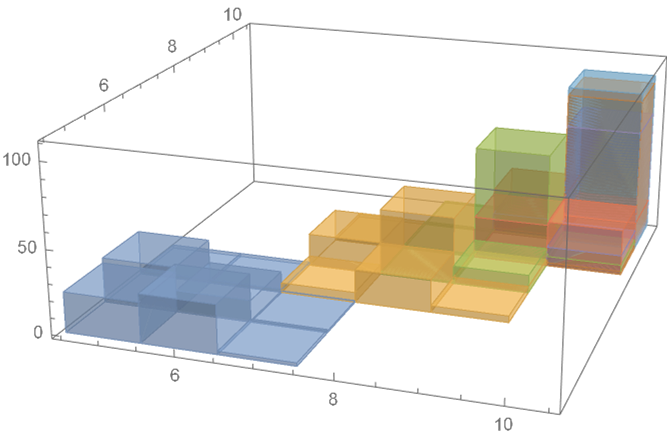
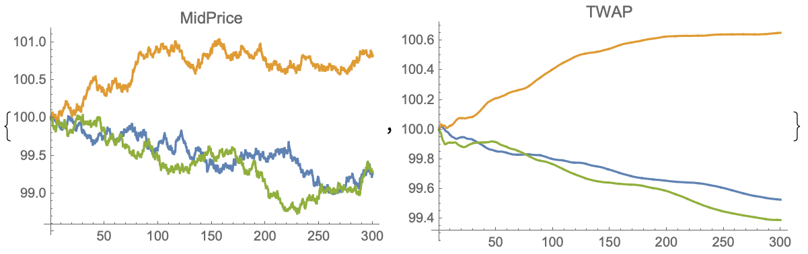
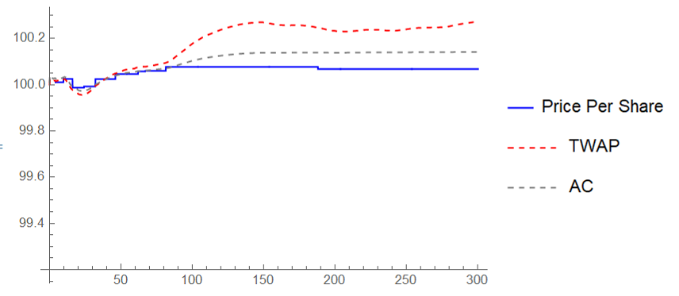
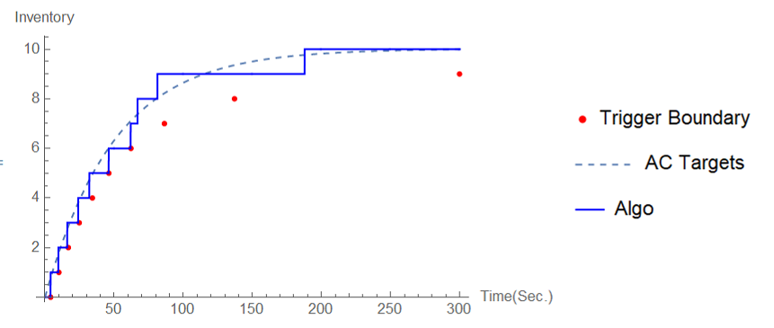

# Optimal-execution-with-limit-and-market-orders
The repo is dedicated to reproduce results of the paper 'Optimal execution with limit and market orders' written by Álvaro Cartea and Sebastian Jaimungal (https://doi.org/10.1080/14697688.2015.1032543)

ÁC and SJ propose an execution policy that tells when to cancel a limit order and submit a market order instead when targeting 
a given volume schedule, such as Almgren-Chriss or TWAP. According to my experience, the waiting time for the LO to be filled is 
hard-coded/ predetemined (invariant within the trading horizon). A potential improvement to the above mentioned method is to optimally switch
between LO & MO.

This paper provides a nice way to that. Moreover, this paper tackles the problem of the depth of LOs.

I am only a beginner to algo tading / optimal control. Please do remind me if I make any mistake in repo. Feel free to leave a comment.

